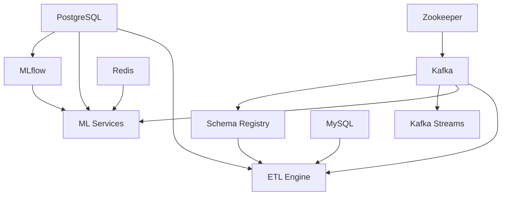

# 🚀 Big Data Platform Docker Startup Guide

This guide provides multiple ways to start the complete Big Data Learning Platform using Docker.

## Prerequisites

- Docker 20.10+ installed
- Docker Compose 2.0+ installed
- At least 8GB RAM available
- At least 10GB disk space

## Quick Start Options

### Option 1: Automated Startup Script (Recommended)

Use the professional startup script that handles everything automatically:

```bash
# Full startup with cleanup
./start-platform.sh

# Start without cleanup (faster if containers exist)
./start-platform.sh --no-cleanup

# Get help
./start-platform.sh --help
```

### Option 2: Manual Docker Compose

```bash
# Build all images
docker-compose build

# Start infrastructure first
docker-compose up -d zookeeper kafka schema-registry postgres mysql redis

# Wait for infrastructure to be ready (30-60 seconds)
sleep 60

# Start MLflow
docker-compose up -d mlflow

# Start application services
docker-compose up -d ml-services etl-engine kafka-streams

# Start monitoring and management
docker-compose up -d prometheus grafana alertmanager kafka-ui redis-commander jupyter
```

### Option 3: Start Everything at Once

```bash
# Build and start all services (may take longer)
docker-compose up -d --build
```

## Service Access Points

Once all services are running, you can access:

### 📊 Analytics & ML
- **ML Services API**: http://localhost:5000
- **MLflow Tracking**: http://localhost:5002
- **Jupyter Notebooks**: http://localhost:8888 (token: `bigdata123`)

### 🔧 Data Processing
- **ETL Engine**: http://localhost:8080
- **ETL Management**: http://localhost:8084

### 📈 Monitoring
- **Grafana Dashboard**: http://localhost:3000 (admin/admin123)
- **Prometheus Metrics**: http://localhost:9090
- **AlertManager**: http://localhost:9093

### 🛠️ Management
- **Kafka UI**: http://localhost:9091
- **Redis Commander**: http://localhost:8082

### 🗄️ Databases
- **PostgreSQL**: localhost:5432 (bigdata_user/bigdata_pass)
- **MySQL**: localhost:3306 (sales_user/sales_pass)
- **Redis**: localhost:6379

### 📡 Messaging
- **Kafka**: localhost:9092
- **Schema Registry**: localhost:8081

## Service Startup Order

For optimal startup, services should be started in this order:

1. **Infrastructure Layer**:
   - Zookeeper
   - Kafka
   - Schema Registry
   - PostgreSQL, MySQL, Redis

2. **Application Layer**:
   - MLflow
   - ML Services
   - ETL Engine
   - Kafka Streams

3. **Monitoring Layer**:
   - Prometheus
   - Grafana
   - AlertManager
   - Management UIs

## Common Commands

```bash
# View service status
docker-compose ps

# View logs for all services
docker-compose logs -f

# View logs for specific service
docker-compose logs -f ml-services

# Restart a service
docker-compose restart ml-services

# Stop all services
docker-compose down

# Stop and remove volumes (clean reset)
docker-compose down -v

# Rebuild specific service
docker-compose build ml-services
docker-compose up -d ml-services

# Scale a service (if stateless)
docker-compose up -d --scale ml-services=2
```

## Troubleshooting

### Services Not Starting
```bash
# Check Docker resources
docker system df
docker system prune -f

# Check service health
docker-compose ps
docker-compose logs [service-name]
```

### Port Conflicts
If you have port conflicts, you can modify the ports in `docker-compose.yml`:
```yaml
ports:
  - "5001:5000"  # Change 5000 to 5001 if port 5000 is in use
```

### Memory Issues
```bash
# Check Docker memory usage
docker stats

# Increase Docker memory limit in Docker Desktop settings
# Recommended: 8GB minimum
```

### Database Connection Issues
```bash
# Check database logs
docker-compose logs postgres
docker-compose logs mysql

# Connect to database directly
docker-compose exec postgres psql -U bigdata_user -d bigdata
docker-compose exec mysql mysql -u sales_user -p sales_data
```

## Environment Configuration

Key environment variables (modify in `docker-compose.yml`):

```yaml
environment:
  # Security
  - SECRET_KEY=your-production-secret-key
  
  # Feature Flags
  - ENABLE_RATE_LIMITING=false
  - ENABLE_AUTH=false
  - ENABLE_METRICS=true
  
  # Performance
  - MAX_BATCH_SIZE=100
  - MAX_CONCURRENT_TRAINING_JOBS=3
```

## Service Dependencies



## Performance Tuning

### For Development (8GB RAM)
```yaml
# In docker-compose.yml, reduce memory allocations:
JAVA_OPTS: "-Xmx1g -Xms512m"
```

### For Production (16GB+ RAM)
```yaml
# In docker-compose.yml, increase memory allocations:
JAVA_OPTS: "-Xmx4g -Xms2g -XX:+UseG1GC"
```

## Data Persistence

All important data is persisted in Docker volumes:
- `postgres-data`: PostgreSQL database
- `mysql-data`: MySQL database  
- `redis-data`: Redis cache
- `kafka-data`: Kafka messages
- `ml_models`: ML model artifacts
- `mlflow_artifacts`: MLflow experiments
- `grafana-data`: Grafana dashboards

## Cleanup

```bash
# Stop services but keep data
docker-compose down

# Complete cleanup (removes all data)
docker-compose down -v
docker system prune -f

# Remove specific volumes
docker volume rm bigdata-platform_postgres-data
```

## Quick Health Check

```bash
# Test key endpoints
curl http://localhost:5000/health        # ML Services
curl http://localhost:5002/health        # MLflow
curl http://localhost:8080/actuator/health  # ETL Engine
curl http://localhost:9090/-/healthy     # Prometheus
```

## Support

If you encounter issues:

1. Check the logs: `docker-compose logs -f`
2. Verify system resources: `docker system df`
3. Review service status: `docker-compose ps`
4. Restart problematic services: `docker-compose restart [service-name]`

For complete platform reset:
```bash
docker-compose down -v
docker system prune -f
./start-platform.sh
``` 